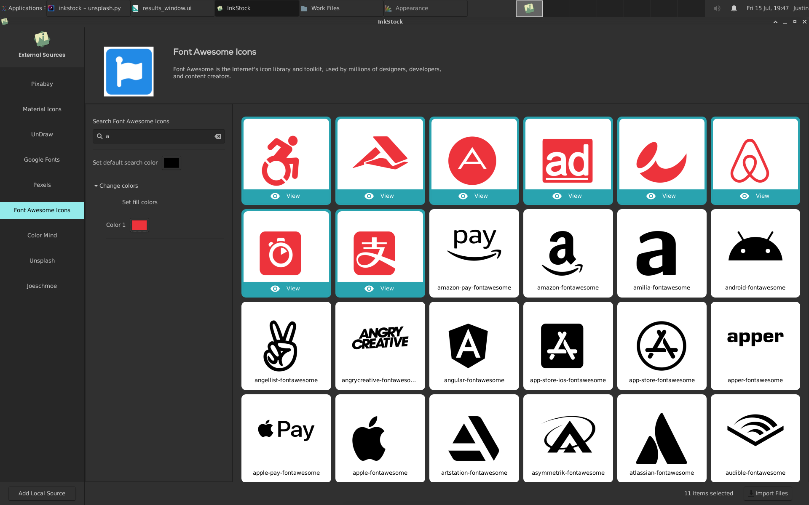

 

# Inkstock

### An application for designers, creators, and developers to fetch, generate and prepare free resources for development, design, UI/UX in one place.

## Screenshots

 
Gallery view

 
Gallery single view

 
Color palette generator

 
Icons

 
Fonts

 
Generate illustrations

 
Illustrations

## Features

- Free stock images from free stock image sites. Currently supported - **Unsplash, Pexels, Pixabay, Burst(dev), Noun(
  dev)**

- Free static illustrations and customizable illustrations **Humaaans(dev), Joeschmoe, UnDraw**
- Free Icons and Icon Packs - **Google material icons, Font awesome icons, Ionicons, Simple icons, Streamline icons**
- Free font packs and sources - **Google Fonts, Freefonts (dev)**
- **Inkscape Extension** for integrating directly into Inkscape vector graphics application
- Intuitive User interface and quick search
- Select items from multiple sources and import as zip, folder, or directly into Inkscape
- Quick edits to photo stocks - Orientation , Color Saturation (Dev) , and more.
- Quick edits to vector stocks - Color
- Remove Background of portraits
- Generate avatars and profile pictures

**Note**

**Still in active development**